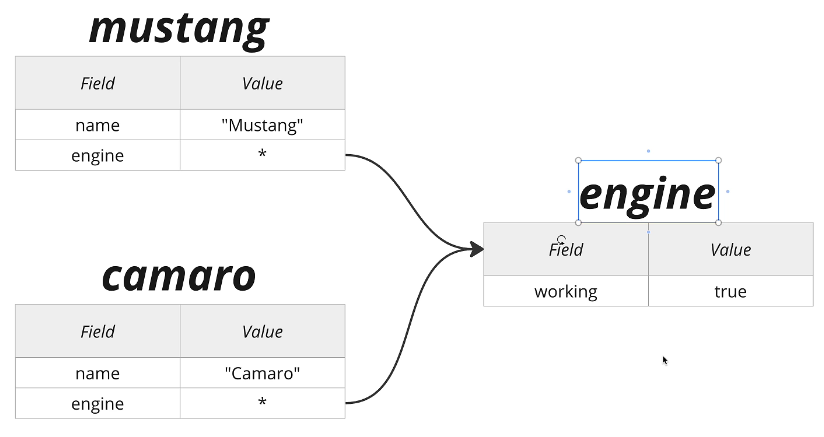

const engine = {
    working: true,
};

const Mustang = {
    name: 'Mustang',
    engine: engine,
};

const Comaro = {
    name: 'Comaro',
    engine: engine,
}

function checkEngine(car) {
    if(car.name == 'Mustan'){
        car.engine.working = false;
    };
};

<!-- There is a error in the above code -->
<!-- In the both engine objects now we will get working as false -->
<!-- But we have set the Mustang object working as false -->

<!-- The error is due to that only single object is present in the memory and both mustang and comaro refer to the same object in the memory -->

